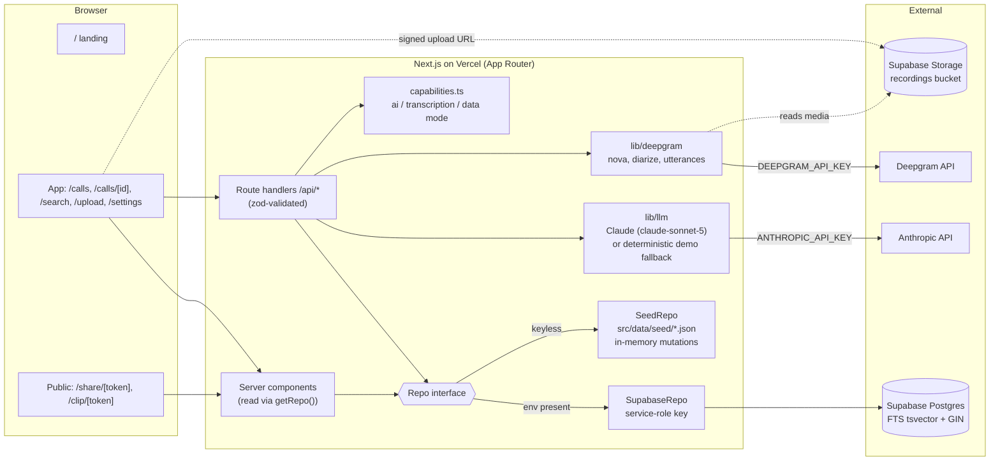

# Fanthom — Architecture

Fanthom is a Fathom.video-style AI meeting notetaker. The source of truth for product scope is
[`docs/SPEC.md`](docs/SPEC.md) (including its **OVERRIDES** section). The code contract is:

- [`src/lib/types.ts`](src/lib/types.ts) — domain types (snake_case, 1:1 with DB columns, all offsets in ms)
- [`src/lib/contracts.ts`](src/lib/contracts.ts) — zod schemas for every API request/response + `ROUTES` map
- [`src/lib/templates.ts`](src/lib/templates.ts) — summary templates and meeting-type → default template
- [`src/lib/db/repo.ts`](src/lib/db/repo.ts) — the `Repo` data-access interface (`getRepo()` in `src/lib/db/index.ts`)
- [`src/lib/capabilities.ts`](src/lib/capabilities.ts) — `aiAvailable()`, `transcriptionAvailable()`, `dataMode()`

Contracts change **additively only**; record changes in the changelog at the bottom.

## 1. System diagram



## 2. Data flow

### Upload → ready meeting (needs `DEEPGRAM_API_KEY` + Supabase)

```mermaid
sequenceDiagram
  participant C as Client (/upload)
  participant A as /api/upload
  participant S as Supabase Storage
  participant P as /api/meetings/:id/process
  participant D as Deepgram
  participant L as Claude (parallel jobs)
  participant DB as Repo

  C->>A: POST {filename, content_type, size_bytes}
  A->>DB: createMeeting(status=processing, stage=awaiting_upload)
  A-->>C: {meeting_id, bucket, path, signed_url, token}
  C->>S: uploadToSignedUrl(path, token, file)
  C->>P: POST {} (returns immediately, stage=queued)
  P->>D: transcribe(media_url, diarize, utterances)  [stage=transcribing]
  D-->>P: utterances (speaker n, start, end, text)
  P->>DB: replaceParticipants + replaceSegments
  par stage=analyzing
    P->>L: summary (default template for type)
    P->>L: action items
    P->>L: chapters (map-reduce for long calls)
    P->>L: highlight suggestions
    P->>L: meeting type + title
  end
  P->>DB: save all (LLM output cached; never generated on page load)
  P->>DB: status=ready, stage=ready
  loop every ~2s
    C->>P: GET /api/meetings/:id/status
  end
  C->>C: router.push(/calls/:id)
```

- Keyless: `/api/meetings/:id/process` returns `503 {code:"transcription_unavailable"}`; the upload page
  explains that real transcription needs the key (honest stub). `GET /api/capabilities` lets the UI know up front.
- With Deepgram but no Anthropic key: transcript is real; AI artifacts come from the deterministic fallback (`ai_mode: "demo"`).
- Processing runs inside the route handler with `export const maxDuration = 300` (Vercel `after()` / waitUntil
  for the post-response work). No queue — acceptable for a demo; documented as a limitation.

### Reading a meeting

`/calls/[id]` (server component) → `getRepo().getMeetingDetail(id)` → `MeetingDetail`
(meeting + participants + segments + summaries + action_items + highlights + chapters) → client call page.
The same aggregate powers `/share/[token]` (via `getMeetingDetailByShareToken`). Clips use `ClipDetail`.

### AI features (summary regenerate, Ask, catch-me-up, follow-up email, decisions, commitments)

Every AI endpoint goes through `src/lib/llm/`:
1. Build transcript lines `[mm:ss] Speaker: text` (segment ids kept alongside for citations).
2. If `aiAvailable()`: call Claude `claude-sonnet-5` → parse JSON with the zod `*LLMOutput` schema → retry once on failure.
   Long calls (>~30 min) map-reduce by chapter.
3. Else: deterministic local implementation (keyword retrieval over segments with citations; extractive,
   template-shaped summaries). Responses carry `ai_mode: "live" | "demo"`; UI shows a subtle "AI offline – demo mode" badge.
4. Cache results via the Repo (summaries per template × language × custom instructions; decisions per meeting).

### Search

`GET /api/search?q=` → `Repo.search` → Supabase: `websearch_to_tsquery` over `transcript_segments.tsv` (GIN),
`ts_headline` with `<mark>` (text HTML-escaped first). Seed mode: tokenised case-insensitive match + the same snippet format.
Result click → `/calls/:id?t=<seconds>` which seeks the player.

## 3. Route map

### Pages

| Route | Purpose | Group | Priority |
|---|---|---|---|
| `/` | Marketing landing (particle/glow hero, app preview, features, CTA → `/calls`) | `(marketing)` | P0 |
| `/calls` | My Calls grouped by date + upcoming strip (seeded) | `(app)` | P0 |
| `/calls/[id]` | Call page: player/timeline left; tabs Summary · Transcript · Action items · Ask right. `?t=` seconds deep link | `(app)` | P0 |
| `/search` | Global search → exact moment | `(app)` | P0 |
| `/upload` | Upload recording + progress | `(app)` | P1 |
| `/playlists` | Playlists / folders | `(app)` | P3 |
| `/settings` | Workspace, stubbed integrations (Slack, HubSpot, Salesforce, Asana, Zapier), capability status | `(app)` | P1 |
| `/share/[token]` | Public read-only meeting (video, transcript, summary) | `(public)` no sidebar | P0 |
| `/clip/[token]` | Public highlight clip | `(public)` | P1 |

### API (all bodies/responses in `contracts.ts`; `ROUTES.api` has the builders)

| Method & path | Request → Response |
|---|---|
| `GET /api/capabilities` | → `CapabilitiesResponse` |
| `GET /api/meetings` | → `ListMeetingsResponse` |
| `GET /api/meetings/:id` | → `GetMeetingResponse` (MeetingDetail) |
| `PATCH /api/meetings/:id` | `UpdateMeetingRequest` → `UpdateMeetingResponse` (type badge / rename) |
| `POST /api/upload` | `UploadRequest` → `UploadResponse` |
| `POST /api/meetings/:id/process` | `ProcessRequest` → `ProcessResponse` |
| `GET /api/meetings/:id/status` | → `StatusResponse` |
| `GET /api/meetings/:id/summary?template&language` | → `GetSummaryResponse` (cache only) |
| `POST /api/meetings/:id/summary` | `RegenerateSummaryRequest` → `RegenerateSummaryResponse` |
| `GET /api/meetings/:id/ask` | → `AskHistoryResponse` |
| `POST /api/meetings/:id/ask` | `AskRequest` → NDJSON stream of `AskStreamEvent` (`start`, `delta`…, `citations`, `done` \| `error`) |
| `POST /api/ask` (P3) | cross-meeting Ask, same stream |
| `GET /api/search?q&meeting_id&limit` | `SearchQuery` → `SearchResponse` |
| `GET/POST /api/meetings/:id/highlights` | → `ListHighlightsResponse` / `CreateHighlightRequest` → `HighlightResponse` |
| `PATCH/DELETE /api/highlights/:id` | `UpdateHighlightRequest` → `HighlightResponse` / `Ok` |
| `POST /api/highlights/:id/share` | → `HighlightShareResponse` |
| `GET /api/clip/:token` | → `ClipResponse` |
| `POST /api/meetings/:id/action-items` | `CreateActionItemRequest` → `ActionItemResponse` |
| `PATCH/DELETE /api/action-items/:id` | `UpdateActionItemRequest` → `ActionItemResponse` / `Ok` |
| `POST/DELETE /api/meetings/:id/share` | `CreateShareRequest` → `CreateShareResponse` / `Ok` |
| `GET /api/share/:token` | → `ShareAccessResponse` (403 `forbidden` unless `anyone_with_link`) |
| `POST /api/meetings/:id/follow-up-email` | `FollowUpEmailRequest` → `FollowUpEmailResponse` |
| `POST /api/meetings/:id/catch-up` | `CatchUpRequest` → `CatchUpResponse` |
| `GET/POST /api/meetings/:id/decisions` | → `DecisionsResponse` (GET cached, POST regenerates) |
| `POST /api/meetings/:id/commitments` | `CommitmentsRequest` → `CommitmentsResponse` |
| `PATCH /api/segments/:id` (P3) | `UpdateSegmentRequest` → `UpdateSegmentResponse` |
| `GET/POST /api/playlists`, `POST /api/playlists/:id/items` (P3) | `ListPlaylistsResponse` / `CreatePlaylistRequest` / `AddPlaylistItemRequest` |

Errors: always `ApiError {error, code?}` with a 4xx/5xx status. Codes: `not_found`, `forbidden`, `validation`,
`llm_failed`, `transcription_unavailable`, `storage_unavailable`.

### Contract decisions other agents must know

- **snake_case everywhere** on the wire (including request bodies: `custom_instructions`, not `customInstructions`).
- **Milliseconds** for all media offsets (`start_ms`, `end_ms`, `timestamp_ms`); `duration_sec` only on meetings.
  Deep links use seconds: `/calls/:id?t=123` (`ROUTES.pages.callAt`).
- `meetings` has two status columns: `status` (processing|ready|failed) and `processing_stage` (awaiting_upload|queued|transcribing|analyzing|ready|failed) + `processing_error`.
- Additional columns beyond the SPEC schema: `meetings.recorded_by`, `meetings.processing_stage`, `meetings.processing_error`,
  `meetings.transcript_language`, `highlights.user_generated`, a `workspaces.domain`, and decisions storage
  (`meeting_insights(meeting_id pk, decisions jsonb)` or a `meetings.decisions jsonb` column — database agent's choice behind `Repo`).
  Upcoming meetings: seeded (`upcoming_meetings` table or seed JSON) → `UpcomingMeeting`.
- `Summary.sections` (`[{heading, bullets:[{text, start_ms}]}]`) is the UI source of truth; `markdown` is for copy/export.
  Default template shown = `defaultTemplateFor(meeting.meeting_type)` in English, else the newest summary.
- `SearchHit.snippet` is HTML-escaped text where only `<mark>` is raw HTML.
- Ask citations: assistant text contains inline `[n]` markers → `Citation.index`. Stream is NDJSON (`application/x-ndjson`).
- Every AI response has `ai_mode`. Seeded meetings ship pre-authored summaries (all key templates), action items,
  chapters, highlights and decisions so nothing needs generating on the live URL.
- Seed media: `media_url = "/media/<meeting-slug>.m4a"` (public/, synthetic multi-voice `say` + ffmpeg audio with exact
  timestamps), `media_kind = "audio"`, `synthetic = true`. For audio meetings the player renders a meeting-style
  participant-tile grid with the active speaker glowing (driven by the transcript).
- `getRepo()` is cached on `globalThis` per server instance. Seed-mode mutations are in-memory and reset on cold start (labelled "demo mode").

## 4. Folder structure

```
src/
  app/
    layout.tsx                 root: <html class="dark">, Inter, Toaster, TooltipProvider
    globals.css                dark theme tokens (navy bg, electric-blue --primary/--brand, .glass, .glow)
    (marketing)/page.tsx       "/" landing
    (app)/layout.tsx           sidebar + top bar shell (mobile: sheet)
    (app)/calls/…              My Calls, call page [id]
    (app)/search|upload|playlists|settings/
    (public)/share/[token]/, (public)/clip/[token]/   no app chrome
    api/…                      route handlers (see route map)
  components/
    brand/                     Logo, PillLink (white pill CTA w/ circular arrow)
    shell/                     AppSidebar, TopBar, nav items
    call/                      player, participant tiles, timeline (markers, chapter rail, speaker bars), header
    transcript/                virtualized transcript, speaker filter, highlight "+"
    summary/                   summary sections, template/language menus, action items, follow-up email
    ui/                        shadcn/ui primitives (radix-nova, neutral base, restyled dark)
  lib/
    types.ts contracts.ts templates.ts capabilities.ts utils.ts
    db/                        repo.ts (interface), index.ts (getRepo), seed-repo.ts, supabase-repo.ts
    llm/                       Claude client, JSON-with-retry, demo fallbacks (extractive)
    prompts/                   prompt builders per job/template
    deepgram/                  transcription client + utterance → segment mapping
  data/seed/                   seed JSON (meetings, participants, segments, summaries, …)
public/media/                  seed audio <slug>.m4a
supabase/migrations/           SQL schema, FTS indexes
scripts/                       seed audio generation, `npm run seed` (Supabase)
seed-src/                      human-authored seed scripts/timings (input to audio + JSON generation)
```

## 5. Scope decisions

| Priority | Built | Why |
|---|---|---|
| **P0** | Seeded calls list · call page with player↔transcript sync (auto-scroll, active line, click-to-seek) · AI summary with template switcher + timestamped bullets · action items · public share page · global search → moment | The core Fathom loop: find a call, read the notes, jump to the moment, share it. |
| **P1** | Highlights → clips (`/clip/[token]`) · per-meeting Ask with citations · upload-and-transcribe · follow-up email | Next most-used Fathom surfaces; Ask differentiates. |
| **P2** | Chapters + chapter rail · speaker timeline + talk-time %, click to filter · Decisions + "What did X commit to?" · Catch me up from minute X · shortcuts (Space, J/L, ⌘K, speed) · virtualized transcript | "Better than Fathom" for the 8-person, 60-minute call. |
| **P3** | Playlists · cross-meeting Ask · transcript edit / reassign speaker · summary language | Nice-to-have; built only if time allows. |

**Stubbed on purpose**

| Stub | Replacement / reason |
|---|---|
| Live recording bot, calendar OAuth | Upload flow + seeded upcoming meetings. Bots need meeting-platform approvals — out of scope. |
| Real auth / SSO | Single demo workspace user, no login. Share access modes `same_domain` / `invited` are stored and shown as a gated screen; only `anyone_with_link` opens. |
| CRM / Slack / Asana / Zapier integrations | Settings shows honest "Coming soon" cards. |
| Billing | Not relevant for a demo. |
| Keys absent (keyless-first) | Seed repo instead of Supabase; deterministic extractive AI fallback (`ai_mode: "demo"`); upload explains transcription needs a key. |
| Seed media | Synthetic multi-voice audio (macOS `say` + ffmpeg), flagged `synthetic: true` and disclosed in README. |

## 6. Ownership

| Agent | Owns |
|---|---|
| architect | `ARCHITECTURE.md`, `README.md`, `src/lib/types.ts`, `src/lib/contracts.ts`, `src/lib/templates.ts`, `src/lib/capabilities.ts`, `src/lib/db/repo.ts`, scaffold, theme tokens, app shell, Vercel deploys |
| database | `supabase/migrations/`, `src/lib/db/{seed-repo,supabase-repo}.ts`, `src/data/seed/`, `scripts/seed*`, seed audio (`public/media/`, `seed-src/`) |
| backend | `src/app/api/**`, `src/lib/llm/`, `src/lib/prompts/`, `src/lib/deepgram/`, demo AI fallbacks |
| frontend | `src/app/(marketing)`, `src/app/(app)/**` pages, `src/app/(public)/**`, `src/components/{call,transcript,summary,brand,shell}` |
| reviewer | Acceptance checks per phase, live-URL smoke tests, hand-in checklist |

## 7. Contract changelog

- **Phase 0** — initial contract. Added `ai_mode` on all AI responses, `GET /api/capabilities`, `Repo` interface, dark theme, `/` = landing and My Calls at `/calls` (per SPEC overrides).
