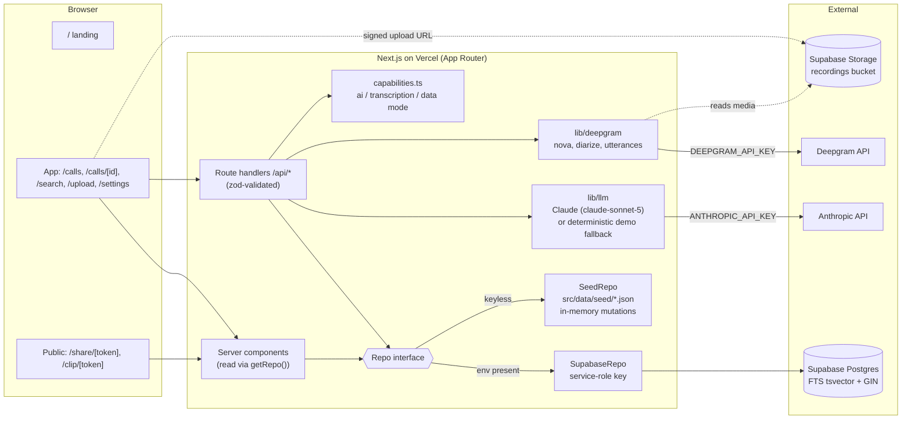
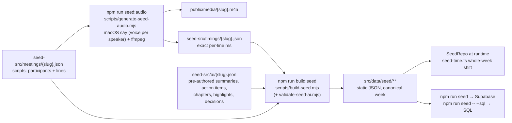

# Fanthom — Architecture

Fanthom is a Fathom.video-style AI meeting notetaker. The source of truth for product scope is
[`docs/SPEC.md`](docs/SPEC.md) (including its **OVERRIDES** section). The code contract is:

- [`src/lib/types.ts`](src/lib/types.ts) — domain types (snake_case, 1:1 with DB columns, all offsets in ms)
- [`src/lib/contracts.ts`](src/lib/contracts.ts) — zod schemas for every API request/response + `ROUTES` map
- [`src/lib/templates.ts`](src/lib/templates.ts) — summary templates and meeting-type → default template
- [`src/lib/db/repo.ts`](src/lib/db/repo.ts) — the `Repo` data-access interface (`getRepo()` in `src/lib/db/index.ts`)
- [`src/lib/capabilities.ts`](src/lib/capabilities.ts) — `aiAvailable()`, `transcriptionAvailable()`, `dataMode()`

Contracts change **additively only**; record changes in the changelog at the bottom.

## 1. System diagram



## 2. Data flow

### Upload → ready meeting (needs `DEEPGRAM_API_KEY` + Supabase)

```mermaid
sequenceDiagram
  participant C as Client (/upload)
  participant A as /api/upload
  participant S as Supabase Storage
  participant P as /api/meetings/:id/process
  participant D as Deepgram
  participant L as Claude (parallel jobs)
  participant DB as Repo

  C->>A: POST {filename, content_type, size_bytes}
  A->>DB: createMeeting(status=processing, stage=awaiting_upload)
  A-->>C: {meeting_id, bucket, path, signed_url, token}
  C->>S: uploadToSignedUrl(path, token, file)
  C->>P: POST {} (returns immediately, stage=queued)
  P->>D: transcribe(media_url, diarize, utterances)  [stage=transcribing]
  D-->>P: utterances (speaker n, start, end, text)
  P->>DB: replaceParticipants + replaceSegments
  par stage=analyzing
    P->>L: summary (default template for type)
    P->>L: action items
    P->>L: chapters (map-reduce for long calls)
    P->>L: highlight suggestions
    P->>L: meeting type + title
  end
  P->>DB: save all (LLM output cached; never generated on page load)
  P->>DB: status=ready, stage=ready
  loop every ~2s
    C->>P: GET /api/meetings/:id/status
  end
  C->>C: router.push(/calls/:id)
```

- Keyless: `/api/meetings/:id/process` returns `503 {code:"transcription_unavailable"}`; the upload page
  explains that real transcription needs the key (honest stub). `GET /api/capabilities` lets the UI know up front.
- With Deepgram but no Anthropic key: transcript is real; AI artifacts come from the deterministic fallback (`ai_mode: "demo"`).
- Processing runs in `src/lib/server/pipeline.ts`, started from the route handler (`maxDuration = 300`, post-response work via
  `after()`). There is no job queue. That's fine for a demo and listed as a known gap.
- Uploads also need Supabase Storage (`SUPABASE_RECORDINGS_BUCKET`, default `recordings`). Without it `/api/upload` returns 503
  `storage_unavailable`, and `/upload` shows the keys notice plus a simulated preview of the pipeline stages.

### Reading a meeting

`/calls/[id]` (server component) → `getRepo().getMeetingDetail(id)` → `MeetingDetail`
(meeting + participants + segments + summaries + action_items + highlights + chapters) → client call page.
The same aggregate powers `/share/[token]` (via `getMeetingDetailByShareToken`). Clips use `ClipDetail`.

### AI features (summary regenerate, Ask, catch-me-up, follow-up email, decisions, commitments)

Every AI endpoint goes through `src/lib/llm/`:
1. Build transcript lines `[mm:ss] Speaker: text` (segment ids kept alongside for citations).
2. If `aiAvailable()`: call Claude `claude-sonnet-5` → parse JSON with the zod `*LLMOutput` schema → retry once on failure.
   Long calls (>~30 min) map-reduce by chapter.
3. Else: deterministic local implementation (keyword retrieval over segments with citations; extractive,
   template-shaped summaries). Responses carry `ai_mode: "live" | "demo"`; UI shows a subtle "AI offline – demo mode" badge.
4. Cache results via the Repo (summaries per template × language × custom instructions; decisions per meeting).

### Search

`GET /api/search?q=` → `Repo.search` → Supabase: `websearch_to_tsquery` over `transcript_segments.tsv` (GIN),
`ts_headline` with `<mark>` (text HTML-escaped first). Seed mode: tokenised case-insensitive match + the same snippet format.
Result click → `/calls/:id?t=<seconds>` which seeks the player.

## 3. Route map

### Pages

| Route | Purpose | Group |
|---|---|---|
| `/` | Marketing landing: floating pill nav, hand-drawn particle-dome canvas hero, live mini call-page preview, feature bento, closing CTA → `/calls` | `(marketing)` |
| `/calls` | My Calls: grouped by day, upcoming strip (seeded), filter, skeleton/empty/error states. Server-rendered with a tz cookie | `(app)` |
| `/calls/[id]` | Call page: participant-tile stage (active speaker glows, captions), player controls, chapter rail, speaker timeline, highlight markers; tabs Summary · Transcript · Action items · Ask. `?t=<sec>` deep link | `(app)` |
| `/search` | Global transcript search grouped by call, `<mark>` snippets, jump to moment (also ⌘K palette) | `(app)` |
| `/ask` | Cross-meeting Ask Fanthom with citations into any call | `(app)` |
| `/upload` | Drag-and-drop upload → signed upload → process → status polling; honest keys notice when keyless | `(app)` |
| `/playlists` | Smart "All highlights" playlist + user playlists, highlights library with type filter | `(app)` |
| `/playlists/[id]` | Playlist detail, Play all (sequential clip player) | `(app)` |
| `/settings` | System status (capabilities), note/share defaults, honestly stubbed integrations | `(app)` |
| `/share/[token]` | Public read-only call view (player, transcript, summary); forbidden / not-found gates | `(public)` |
| `/clip/[token]` | Public highlight clip: bounded playback, replay, transcript excerpt, copy link | `(public)` |

Unknown call/share/clip ids return a real 404.

### API (bodies/responses in `contracts.ts`; builders in `ROUTES.api` from `src/lib/routes.ts`, a zod-free module that client bundles can import)

| Method & path | Request → Response |
|---|---|
| `GET /api/capabilities` | → `CapabilitiesResponse` |
| `GET /api/meetings` | → `ListMeetingsResponse` |
| `GET / PATCH /api/meetings/:id` | → `MeetingDetail` / `UpdateMeetingRequest` → `UpdateMeetingResponse` |
| `POST /api/upload` | `UploadRequest` → `UploadResponse` |
| `POST /api/meetings/:id/process` | `ProcessRequest` → `ProcessResponse` |
| `GET /api/meetings/:id/status` | → `StatusResponse` |
| `GET / POST /api/meetings/:id/summary` | cache lookup / `RegenerateSummaryRequest` → `RegenerateSummaryResponse` |
| `GET / POST /api/meetings/:id/ask` | history / NDJSON stream of `AskStreamEvent` |
| `POST /api/ask` | cross-meeting Ask, same NDJSON stream |
| `GET /api/search?q&meeting_id&limit` | → `SearchResponse` |
| `GET / POST /api/meetings/:id/highlights` | list / `CreateHighlightRequest` → `HighlightResponse` |
| `PATCH / DELETE /api/highlights/:id` | `UpdateHighlightRequest` → `HighlightResponse` / `Ok` |
| `POST /api/highlights/:id/share` | → `HighlightShareResponse` |
| `GET /api/clip/:token` | → `ClipResponse` |
| `POST /api/meetings/:id/action-items` | `CreateActionItemRequest` → `ActionItemResponse` |
| `PATCH / DELETE /api/action-items/:id` | `UpdateActionItemRequest` → `ActionItemResponse` / `Ok` |
| `POST / DELETE /api/meetings/:id/share` | `CreateShareRequest` → `CreateShareResponse` / `Ok` |
| `GET /api/share/:token` | → `MeetingDetail` (403 unless `anyone_with_link`) |
| `POST /api/meetings/:id/follow-up-email` | `FollowUpEmailRequest` → `FollowUpEmailResponse` |
| `POST /api/meetings/:id/catch-up` | `CatchUpRequest` → `CatchUpResponse` |
| `GET / POST /api/meetings/:id/decisions` | → `DecisionsResponse` |
| `POST /api/meetings/:id/commitments` | `CommitmentsRequest` → `CommitmentsResponse` |
| `PATCH /api/segments/:id` | `UpdateSegmentRequest` → `UpdateSegmentResponse` |
| `GET / POST /api/playlists` | list / create |
| `GET / PATCH / DELETE /api/playlists/:id` | playlist detail / rename / delete |
| `POST /api/playlists/:id/items`, `DELETE /api/playlists/:id/items/:itemId` | add / remove item (positions renumbered) |

Errors are always `ApiError {error, code?}`. Codes: `not_found`, `forbidden`, `validation`, `rate_limited`,
`llm_failed`, `transcription_unavailable`, `storage_unavailable`.

### Contract decisions

- Everything on the wire is **snake_case** and all media offsets are **ms**. Deep links use seconds (`/calls/:id?t=123`).
- `meetings.status` (processing|ready|failed) + `processing_stage` + `processing_error`.
- The UI renders from `Summary.sections`; `markdown` exists for copy/export.
- `SearchHit.snippet` is HTML-escaped text where only `<mark>` is raw HTML.
- Ask citations appear inline as `[n]`, matching `Citation.index`. The stream is NDJSON.
- Every AI response carries `ai_mode`.

## 4. Demo mode vs live mode

The same build runs in either mode. The UI never branches on which data store is active; it reads `ai_mode` only to show a badge.

| Concern | Keyless (demo) | With keys (live) |
|---|---|---|
| **Data** (`getRepo()` in `src/lib/db/index.ts`) | `SeedRepo`: static JSON from `src/data/seed/` loaded in memory, keyword search, and mutations kept in memory per server instance (reset on cold start) | `SupabaseRepo` when `NEXT_PUBLIC_SUPABASE_URL` + `SUPABASE_SERVICE_ROLE_KEY` are set. Postgres FTS (`search_segments`, `ts_headline`) |
| **AI** (`src/lib/ai`, `src/lib/llm`) | Seeded meetings carry pre-authored summaries, action items, chapters, highlights and decisions. Regenerate / Ask / catch-up / email / commitments use deterministic extractive fallbacks (`src/lib/ai/demo.ts`) → `ai_mode: "demo"` + "AI offline – demo mode" badge | `ANTHROPIC_API_KEY` → Claude (`claude-sonnet-5`, override with `ANTHROPIC_MODEL`), zod-validated JSON, retry once, map-reduce for long calls → `ai_mode: "live"` |
| **Transcription** | `/upload` explains that it needs keys and shows a simulated stage preview | `DEEPGRAM_API_KEY` (nova, diarize, utterances; `DEEPGRAM_MODEL`), AssemblyAI as fallback |
| **Capabilities** | `GET /api/capabilities` → `{ai_mode, transcription, data_mode}`, shown on `/settings` | same |

**Self-contained clip tokens (demo mode).** On Vercel, pages and route handlers can run in separate function instances,
each with its own in-memory seed store. So in seed mode a user-created highlight's `share_token` carries the clip itself:
`c_` + base64url(JSON `{m: meeting_id, s: start_ms, e: end_ms, t: type, ti: title, n?: note}`)
(`src/lib/db/clip-token.ts`, note capped at 280 chars). `SeedRepo.getClipByToken` looks in the store first, then
decodes the token statelessly. The meeting must exist and be ready, the bounds must fall within the call, and the type
must be valid. It then builds the `ClipDetail` from seed data. Editing a highlight re-encodes its token. Deleting one
blocks its token in that instance only. Seeded clip tokens and Supabase mode (random tokens) are unchanged. There is no
contract change: `share_token` is still an opaque string.

**Demo Ask retrieval** (`demoAsk` / `demoAskAcross` in `src/lib/ai/demo.ts`):
- Topic terms come from the question after removing question words and intent words (who/owns/owner/responsible/when…).
  Two-letter acronyms such as GA, QA and AI are kept.
- Each term is weighted by IDF, so the rarest term dominates. Segments that match several topic terms are strongly
  boosted, and hits must contain one of the rarest terms whenever any segment does.
- "Who owns X" answers append the matching action items with their owners. Topical questions also append the matching
  decision. Regression: `npm run check:ask` (`scripts/check-demo-ask.mts`).

### Abuse protection (`src/proxy.ts`, `src/lib/server/{demo-session,rate-limit,api}.ts`)

- **Demo-session cookie.** `src/proxy.ts` sets the httpOnly `fanthom_demo` cookie on the landing page and app pages
  (`/`, `/calls`, `/search`, `/upload`, `/playlists`, `/settings`). API **write** routes require it (`route()` in `api.ts`),
  so anyone holding only a public `/share` or `/clip` link can view but gets `403 forbidden` if they try to change anything. Public pages and GET APIs don't need the cookie.
- **Rate limits.** In-memory limits per server instance, applied on every LLM and transcription route:
  - A per-IP token bucket: burst `RATE_LIMIT_IP_BURST` (default 20), refilling at `RATE_LIMIT_IP_PER_MIN` (default 10) per minute.
  - A per-meeting cap on paid generations: `RATE_LIMIT_MEETING_PER_HOUR` (default 30), counted only when a key is set, or when Deepgram is used.
  - Exceeding either returns `429 rate_limited` with `Retry-After`. A shared Redis store would be the production upgrade.

## 5. Seed pipeline



- **Audio.** Every line is rendered separately with its own `say` voice and stitched together with ffmpeg, so each transcript timestamp matches the audio exactly.
  Output is mono AAC `.m4a`. Seed meetings are flagged `synthetic: true`.
- **Dates.** The JSON is static and written against a fixed canonical week in which the flagship "Q4 Roadmap Planning" is on a Thursday at 10:00 ET.
  At load time, `src/lib/db/seed-time.ts` shifts every timestamp forward by **whole weeks**, with a DST correction, so the flagship is always the most recent Thursday.
  Upcoming meetings move to their next future occurrence. Because the shift is whole weeks, weekdays spoken in the calls ("see you Thursday") stay true.
- **Nine meetings.** Sales discovery, weekly stand-up, 1:1, CS QBR (external), staff-engineer interview, pricing-page planning, design review,
  vendor security review, and the 8-person, ~58-minute Q4 Roadmap Planning call (11 chapters).

### npm scripts

| Script | What it does |
|---|---|
| `npm run seed:audio` | Regenerates `public/media/*.m4a` + `seed-src/timings/*.json` (macOS only: `say` + ffmpeg; `TTS_CONCURRENCY`) |
| `npm run build:seed` | Validates `seed-src/ai` and builds `src/data/seed/**` (no dependencies) |
| `npm run seed` | `build:seed`, then loads Supabase idempotently (seed meetings are replaced wholesale) using `.env.local` |
| `node scripts/seed.mts --sql` | Prints the same data as idempotent SQL, to paste into the Supabase SQL editor |
| `npm run dev / build / lint` | Next.js |

Schema: `supabase/migrations/0001_init.sql` (tables, `tsv` generated column + GIN, `(meeting_id, start_ms)` index, `search_segments` RPC).

## 6. Folder structure

```
src/
  proxy.ts                     demo-session cookie on app pages
  app/
    (marketing)/page.tsx       "/" landing
    (app)/layout.tsx           sidebar + top bar shell (mobile: sheet), ⌘K command palette
    (app)/calls/(list), calls/[id], search, ask, upload, playlists/(list), playlists/[id], settings
    (public)/share/[token], (public)/clip/[token]
    api/**                     route handlers (see route map)
  components/
    brand/ shell/ call/ transcript/ summary/ playlists/ ui/
  lib/
    types.ts contracts.ts routes.ts templates.ts capabilities.ts
    db/                        repo.ts, index.ts (getRepo), seed-repo.ts, supabase-repo.ts, seed-time.ts
    ai/                        Ask + demo (extractive) implementations, transcript formatting
    llm/                       Claude client, JSON extraction + retry
    prompts/                   one builder per job (summary, action items, chapters, highlights, decisions, …)
    deepgram/                  transcription client
    server/                    api route wrapper, errors, rate-limit, demo-session, pipeline, storage, ndjson
    search/ ui/                text helpers, client API + formatting
    analytics/ export/ integrations/   Phase 5 pure logic: coaching, insights, trackers, deals, library filters; downloads; webhooks/Slack/CRM/bot
  data/seed/                   built seed JSON
public/media/                  seed audio
seed-src/                      scripts, timings, pre-authored AI
scripts/                       generate-seed-audio, build-seed, validate-seed-ai, seed.mts
supabase/migrations/           SQL schema
```

## 7. Scope decisions

| Priority | Status | Scope |
|---|---|---|
| **P0** | Built | Seeded calls list · call page with player↔transcript sync · summary with template switcher and timestamped bullets · action items · public share · global search → moment |
| **P1** | Built | Highlights → clips · per-meeting Ask with citations · upload-and-transcribe (with keys) · follow-up email |
| **P2** | Built | Chapters rail · speaker timeline, talk-time % and filter · decisions · "what did X commit to?" · catch me up · shortcuts · virtualized transcript · participant stage |
| **P3** | Built | Playlists (+ play all) · cross-meeting Ask · summary language · transcript segment edit API |

**Stubbed on purpose:** live recording bot and calendar OAuth (replaced by upload + seeded upcoming meetings); real auth/SSO
(one demo workspace user; `same_domain` / `invited` share modes are stored but show a gated screen); CRM / Slack /
Asana / Zapier (honest "coming soon" cards on Settings); billing.

## 8. Ownership

| Agent | Owns |
|---|---|
| architect | `ARCHITECTURE.md`, `README.md`, `WALKTHROUGH.md`, contracts (`types.ts`, `contracts.ts`, `templates.ts`, `capabilities.ts`, `db/repo.ts`), scaffold, theme, app shell, deploys |
| database | `supabase/migrations/`, `src/lib/db/*` implementations + `seed-time.ts`, `seed-src/`, `scripts/*seed*`, `public/media/`, `src/data/seed/` |
| backend | `src/app/api/**`, `src/lib/{ai,llm,prompts,deepgram,server}/`, `src/proxy.ts` |
| frontend | `src/app/(marketing|app|public)/**`, `src/components/**`, `src/lib/ui/`, `src/lib/routes.ts` page helpers |
| reviewer | Acceptance checks per phase, live-URL smoke tests, hand-in checklist |

## 9. Contract changelog

- **Phase 0**: initial contract; `ai_mode` on all AI responses; `GET /api/capabilities`; `Repo` interface; dark theme; `/` is the landing page and My Calls lives at `/calls`.
- **Phase 5**: see §10. Additive only: optional `Meeting.folder_id/starred/deleted_at`; optional `MeetingListItem`
  library fields; `UpdateMeetingRequest` gains `folder_id/starred/deleted`; `ListMeetingsResponse.folders?`;
  `Repo.listMeetings(opts?)`; ~50 new Repo methods, new schemas/routes for every Phase 5 endpoint.
- **Phase 1–3**: `routes.ts` split out of `contracts.ts` (zod-free, re-exported); `ROUTES.pages.playlist` and `ROUTES.pages.ask` added;
  `Repo.getPlaylist` / `removePlaylistItem` added; playlist detail/delete APIs; `rate_limited` error code; demo-session cookie required for writes.

## 10. Phase 5 — full Fathom parity (contract)

Scope: `docs/SPEC.md` "PHASE 5" (A library, B capture, C insights, D collaboration & export, E account & team,
F marketing). Keyless-first still holds: every feature works in seed mode; integrations that can be real with
only a user-supplied URL (outgoing webhooks, Slack incoming webhook) ARE real; the meeting bot, calendar OAuth,
CRM OAuth, team invites and email sending are simulated and labelled as such in the UI.

### 10.1 New pages (`ROUTES.pages`)

| Route | Purpose | Owner |
|---|---|---|
| `/calls` (extended) | Tabs My calls / Shared with me / Team, filters (type, participant, company, date, has action items, starred), sort, rename/star/delete, multi-select bulk move, trash | frontend-A |
| `/folders/[id]` | Folder library page (sidebar lists folders) | frontend-A |
| `/record` | In-browser recorder (mic + optional screen/tab via getDisplayMedia, MediaRecorder, timer, level meter → upload pipeline) and "Send Fanthom to a live meeting" bot panel (simulated) | frontend-A |
| `/calendar` | Week view of upcoming events, per-event Record toggle, auto-record rule picker | frontend-A |
| `/team` | Members, roles, invite (stub) | frontend-A |
| `/welcome` | Onboarding: connect calendar (stub) → default template → record first meeting | frontend-A |
| `/settings?tab=` | general / recording / notifications / integrations (webhooks, Slack, CRM) — server prefs | frontend-A |
| `/pricing`, `/features`, `/integrations` | Marketing pages (+ FAQ, footer) | frontend-A |
| `/calls/[id]` (extended) | Coaching metrics panel, comments + timeline markers + @mentions, emoji reactions, downloads menu, clip trim editor, tracker markers, `<video>` for `media_kind: "video"`, Slack/CRM/email-recap actions | frontend-B |
| `/insights` | Team dashboard: totals, weekly trends, per-person averages, meeting load heatmap | frontend-B |
| `/trackers`, `/trackers/[id]` | Tracker CRUD; hits across calls with jump-to-moment | frontend-B |
| `/deals`, `/deals/[domain]` | Companies from external calls; timeline, stakeholders, latest summary, next steps, BANT/MEDDPICC (editable) | frontend-B |

App-shell nav (frontend-A) adds: Record, Calendar, Insights, Trackers, Deals, Team, folders list, notification bell, "Demo workspace" badge.

### 10.2 New API (schemas in `contracts.ts` "PHASE 5"; builders in `ROUTES.api`)

| Method & path | Request → Response |
|---|---|
| `GET /api/meetings?…` | `ListMeetingsQuery` → `ListMeetingsResponse` (+ `folders`) |
| `PATCH /api/meetings/:id` | `UpdateMeetingRequest` (+ `folder_id`, `starred`, `deleted`) → `UpdateMeetingResponse` |
| `DELETE /api/meetings/:id` | → `Ok` (soft delete) |
| `POST /api/meetings/bulk` | `BulkMeetingsRequest` → `BulkMeetingsResponse` |
| `GET / POST /api/folders` | → `ListFoldersResponse` / `CreateFolderRequest` → `FolderResponse` |
| `PATCH / DELETE /api/folders/:id` | `UpdateFolderRequest` → `FolderResponse` / `Ok` |
| `POST /api/folders/:id/meetings` | `MoveToFolderRequest` → `MoveToFolderResponse` (`:id` = `none` removes from folder) |
| `GET /api/meetings/:id/coaching` | → `CoachingResponse` |
| `GET /api/meetings/:id/trackers` | → `MeetingTrackerHitsResponse` |
| `GET /api/insights?range&internal_only` | `InsightsQuery` → `InsightsResponse` |
| `GET / POST /api/trackers` | → `ListTrackersResponse` / `CreateTrackerRequest` → `TrackerResponse` |
| `PATCH / DELETE /api/trackers/:id` | `UpdateTrackerRequest` → `TrackerResponse` / `Ok` |
| `GET /api/trackers/:id/hits` | `TrackerHitsQuery` → `TrackerHitsResponse` |
| `GET /api/deals` | → `ListDealsResponse` |
| `GET / PATCH /api/deals/:domain` | → `DealResponse` / `UpdateDealRequest` → `DealResponse` |
| `GET / POST /api/meetings/:id/comments` | → `ListCommentsResponse` / `CreateCommentRequest` → `CommentResponse` |
| `PATCH / DELETE /api/comments/:id` | `UpdateCommentRequest` → `CommentResponse` / `Ok` |
| `GET /api/meetings/:id/reactions` | → `ListReactionsResponse` |
| `POST /api/segments/:id/reactions` | `ToggleReactionRequest` → `ToggleReactionResponse` |
| `GET /api/meetings/:id/download?format&template&language` | `DownloadQuery` → file attachment (`recording` → 302 to media) |
| `PATCH /api/highlights/:id` (trim) | existing `UpdateHighlightRequest`; handler validates with `TrimHighlightRequest` |
| `GET / POST /api/integrations/webhooks` | → `ListWebhooksResponse` / `CreateWebhookRequest` → `WebhookResponse` |
| `PATCH / DELETE /api/integrations/webhooks/:id` | `UpdateWebhookRequest` → `WebhookResponse` / `Ok` |
| `POST /api/integrations/webhooks/:id/test` | `TestWebhookRequest` → `WebhookDeliveryResponse` (real POST) |
| `GET /api/integrations/webhooks/:id/deliveries` | → `ListWebhookDeliveriesResponse` |
| `GET / PUT /api/integrations/slack` | → `SlackConfigResponse` / `UpdateSlackConfigRequest` → `SlackConfigResponse` |
| `POST /api/integrations/slack/test` | → `SendToSlackResponse` (real POST) |
| `POST /api/meetings/:id/slack` | `SendToSlackRequest` → `SendToSlackResponse` (real POST) |
| `GET / POST /api/meetings/:id/crm` | `CrmPreviewQuery` → `CrmPreviewResponse` / `CrmSyncRequest` → `CrmSyncResponse` (simulated, logged) |
| `GET /api/integrations/crm/logs?meeting_id` | → `CrmLogsResponse` |
| `POST /api/meetings/:id/email-recap` | `EmailRecapRequest` → `EmailRecapResponse` (preview only) |
| `GET / POST /api/bots` | → `ListBotSessionsResponse` / `CreateBotSessionRequest` → `BotSessionResponse` |
| `GET /api/bots/:id` | → `BotSessionResponse` (may auto-advance by elapsed time) |
| `POST /api/bots/:id/advance` | `AdvanceBotSessionRequest` → `BotSessionResponse` (409 on illegal transition) |
| `GET /api/calendar?from&to` | `CalendarQuery` → `CalendarResponse` |
| `PATCH /api/calendar/:eventId` | `UpdateCalendarEventRequest` → `CalendarEventResponse` |
| `GET / PATCH /api/prefs` | → `PrefsResponse` / `UpdatePrefsRequest` → `PrefsResponse` |
| `GET /api/me` | → `MeResponse` |
| `GET /api/team` | → `ListTeamResponse` |
| `POST /api/team/invite` | `InviteTeamRequest` → `InviteTeamResponse` (stub: no email) |
| `PATCH / DELETE /api/team/:id` | `UpdateTeamMemberRequest` → `TeamMemberResponse` / `Ok` |
| `GET /api/notifications?unread&limit` | `ListNotificationsQuery` → `ListNotificationsResponse` |
| `POST /api/notifications/read` | `MarkNotificationsReadRequest` → `MarkNotificationsReadResponse` |

New error code in use: `not_implemented` (501) — thrown by the temporary repo stubs in
`src/lib/db/phase5-stubs.ts` until the database agent implements each method.

### 10.3 Where logic lives

- **Repo** (`src/lib/db/repo.ts`, "Phase 5" block): persistence only — folders, trackers, deal overrides, comments,
  reactions, webhooks + deliveries, Slack config, CRM logs, bot sessions, `cloneMeetingFromTemplate`, calendar
  events + record override, prefs, current session, team, notifications, plus `listMeetingDetails` and
  `updateMeetings` (bulk).
- **Pure analytics** (`src/lib/analytics/`, isomorphic): `coaching.ts` (`computeCoachingMetrics`),
  `insights.ts` (`computeInsights`, `rangeStart`), `trackers.ts` (`findTrackerHits`, `findMeetingTrackerHits`,
  `withTrackerStats`), `deals.ts` (`emailDomain`, `companyNameFromDomain`, `primaryCompany`, `deriveDealFields`,
  `applyDealOverrides`, `groupCompanies`, `buildCompanyDetail`), `library.ts` (`filterMeetings`),
  `calendar.ts` (`ruleRecords`, `effectiveRecord`).
- **Export** (`src/lib/export/`): `transcript.ts` (`transcriptToTxt/Srt/Vtt/Markdown`, `formatCueTime`),
  `summary.ts` (`summaryToMarkdown`, `buildEmailRecap`), `download.ts` (`buildDownload`, `slugify`).
- **Integrations** (`src/lib/integrations/`): `bot.ts` (`detectPlatform`, `advanceBot`, `BOT_NEXT`,
  `BOT_AUTO_ADVANCE_MS`), `webhooks.ts` (`buildWebhookPayload`, `signWebhookBody`, `validateWebhookUrl`,
  `deliverWebhook`, `dispatchEvent`), `slack.ts` (`buildSlackRecap`, `postToSlack`, `toSlackConfigView`),
  `crm.ts` (`buildCrmPreview`).
  All ship as `throw new Error("TODO")` stubs with JSDoc describing behaviour; backend implements them.

### 10.4 Phase 5 ownership

| Agent | Owns |
|---|---|
| database | Every Phase 5 Repo method in `seed-repo.ts` + `supabase-repo.ts` (replace `phase5RepoStubs`, then delete `phase5-stubs.ts`); `supabase/migrations/0002_parity.sql`; seed data for folders, comments, reactions, trackers, team (~14 Northwind people), webhooks, notifications, calendar events (with meeting URLs/platforms), prefs; `recorded_by`/`share_invited_emails` variety so the three library tabs are populated |
| backend | All Phase 5 API routes under `src/app/api/**`; `src/lib/analytics/*`, `src/lib/export/*`, `src/lib/integrations/*` (real webhook + Slack fetch, bot state machine, CRM preview); pipeline hook: on `meeting.ready` → notifications + `dispatchEvent` + Slack auto-post |
| frontend-A | App shell nav + folders sidebar + notification bell + demo badge; library (tabs, filters, sort, star/rename/delete, bulk move, trash); `/folders/[id]`; `/record` + bot flow; `/calendar`; `/team`; `/welcome`; settings (server prefs, integrations config UI: webhooks, Slack, CRM); marketing `/pricing`, `/features`, `/integrations` + landing links |
| frontend-B | Call page additions (coaching panel, comments + timeline markers + @mentions, reactions, downloads menu, clip trim editor, `<video>` playback, tracker markers, Slack/CRM/email-recap actions); `/insights`; `/trackers`, `/trackers/[id]`; `/deals`, `/deals/[domain]` |
| architect | Contracts (`types.ts`, `contracts.ts`, `routes.ts`, `repo.ts`), this document, README |

Contract-change protocol is unchanged: additive only, logged in §9.
